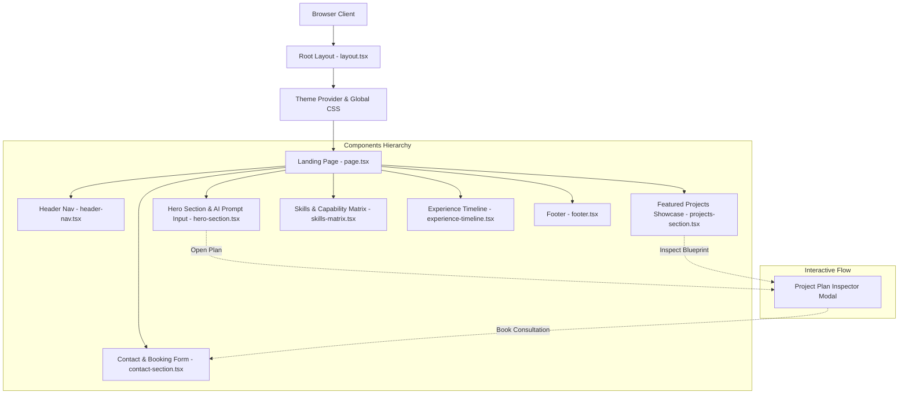

<div align="center">

# 🚀 Next.js Developer Portfolio & Interactive AI Project Planner

An elite, high-impact developer portfolio built with **Next.js 16 (App Router)**, **React 19**, **TypeScript**, and **Tailwind CSS v4**. Featuring a dark glowing UI, interactive project architecture inspectors, preset plan generation, and modular design system.

[](https://nextjs.org/)
[](https://react.dev/)
[](https://www.typescriptlang.org/)
[](https://tailwindcss.com/)
[](./LICENSE)
[](#)

[**🌐 Live Demo**](https://[YOUR_PORTFOLIO_DOMAIN].vercel.app) • [**📖 Architecture Docs**](./docs/ARCHITECTURE.md) • [**🛠️ Customization Guide**](./docs/CUSTOMIZATION.md) • [**🚀 Deployment Guide**](./docs/DEPLOYMENT.md)

</div>

---

## 📸 Preview & Visual Interface

> **[INSERT YOUR APPLICATION SCREENSHOT OR DEMO GIF HERE]**
> *Replace this text with a high-resolution screenshot or animated demo of your portfolio landing page and project inspector modal.*

---

## ✨ Key Features & Engineering Highlights

- **⚡ Interactive AI Project Plan Generator**: Generate instant technical architecture breakdowns, technology stack choices, and delivery timelines directly from the hero interface.
- **🔍 Full-Screen Architecture Inspector Modal**: Deep dive into project blueprints, technical dependencies, step-by-step milestones, and estimated delivery dates.
- **🚀 Featured Projects Showcase**: Grid display of real-world applications featuring status badges (*Live*, *Beta*, *In Architecture*), tech stacks, live links, and GitHub repository links.
- **📊 Skills & Capability Matrix**: Categorized technical proficiency matrix spanning Frontend Architecture, Backend Systems, AI/ML Engineering, and Cloud Infrastructure.
- **💼 Career Experience Timeline**: Detailed work history highlighting key metrics, measurable outcomes, and technology stacks utilized.
- **📬 Interactive Consultation Booking**: Seamless transition from project plan inspection directly into consultation booking and contact submission.
- **🌙 Glassmorphic Dark Aesthetics**: Curated color palette (Amber glow, Pitch Zinc dark background, Emerald status accents) with responsive typography and micro-interactions.

---

## 🛠️ Tech Stack & Dependencies

| Category | Technology | Purpose |
| :--- | :--- | :--- |
| **Framework** | Next.js 16.3 (App Router) | Static pre-rendering, route handling, fast TTFB |
| **UI Library** | React 19.2 | Client component state orchestration |
| **Language** | TypeScript 5 | Strict type checking & clean interface definitions |
| **Styling** | Tailwind CSS v4 & Vanilla CSS | Custom design tokens, glowing effects, grid layouts |
| **Icons & UI** | Lucide React & Base UI | Crisp vector icons & accessible UI primitives |
| **Theme** | Next-Themes | SSR-safe theme provider |
| **Package Manager**| pnpm / npm | Dependency resolution & script execution |

---

## 🏗️ System Architecture & Data Flow



---

## 📁 Repository Structure

```
├── app/
│   ├── favicon.ico           # Web application favicon
│   ├── globals.css          # Design tokens, amber glow variables, Tailwind v4 imports
│   ├── layout.tsx           # Global HTML wrapper, Geist fonts, Theme Provider
│   └── page.tsx             # Portfolio page layout & interactive state controller
├── components/
│   ├── contact-section.tsx   # Consultation booking & direct contact form
│   ├── experience-timeline.tsx # Career milestone timeline & achievements
│   ├── footer.tsx            # Footer navigation & copyright metadata
│   ├── header-nav.tsx        # Sticky navigation bar with quick links & CTA button
│   ├── hero-section.tsx      # Split hero section & preset AI prompt selector
│   ├── icons.tsx             # Custom SVG vectors & brand icons
│   ├── project-plan-modal.tsx# Deep technical architecture inspector modal
│   ├── projects-section.tsx  # Featured portfolio projects grid
│   ├── skills-matrix.tsx     # Tech stack capabilities & proficiency breakdown
│   ├── theme-provider.tsx    # Next-themes client wrapper
│   └── ui/                   # Modular UI primitives (Button, Card, Modal)
├── docs/
│   ├── ARCHITECTURE.md       # Technical specification & system design
│   ├── CUSTOMIZATION.md      # Step-by-step developer customization guide
│   └── DEPLOYMENT.md         # Deployment guide for Vercel, Netlify & Docker
├── lib/
│   └── utils.ts              # Class name merging utility (clsx + tailwind-merge)
├── .env.example              # Environment variables template
├── CODE_OF_CONDUCT.md        # Contributor Covenant Code of Conduct
├── CONTRIBUTING.md           # Contribution & PR guidelines
├── LICENSE                   # MIT Open Source License
└── package.json              # Dependencies & npm scripts
```

---

## ⚡ Quick Start & Local Development

### Prerequisites

Ensure you have Node.js 20+ and pnpm (or npm / yarn) installed:
- **Node.js**: `>= 20.0.0`
- **pnpm**: `>= 9.0.0`

### 1. Clone the Repository
```bash
git clone https://github.com/[YOUR_GITHUB_USERNAME]/portfolio.git
cd portfolio
```

### 2. Install Dependencies
```bash
pnpm install
```

### 3. Setup Environment Variables
Copy `.env.example` to `.env.local`:
```bash
cp .env.example .env.local
```

### 4. Run Development Server
```bash
pnpm run dev
```
Open [http://localhost:3000](http://localhost:3000) in your browser to view the portfolio.

---

## 📜 Available Scripts

In the project directory, you can run:

| Command | Action |
| :--- | :--- |
| `pnpm run dev` | Starts the Next.js development server with Turbopack |
| `pnpm run build` | Builds the optimized production application |
| `pnpm run start` | Runs the built production server locally |
| `pnpm run lint` | Runs ESLint checks across TypeScript files |
| `pnpm run typecheck` | Validates TypeScript types without emitting code |
| `pnpm run format` | Formats all TSX/TS files using Prettier |

---

## 📋 Recruiter / Owner Customization Checklist

To personalize this portfolio with your information, replace the following placeholders across the repository:

- [ ] **Name & Title**: Search and replace `[YOUR NAME]` with your full name in `README.md`, `LICENSE`, `.env.example`, and `components/footer.tsx`.
- [ ] **Live Demo URL**: Replace `[YOUR_PORTFOLIO_DOMAIN]` in `README.md` and `.env.example`.
- [ ] **Social Profiles**: Update GitHub (`[YOUR_GITHUB_USERNAME]`), LinkedIn, and Twitter URLs in `components/header-nav.tsx` and `components/footer.tsx`.
- [ ] **Contact Form**: Update email address `[YOUR_EMAIL@EXAMPLE.COM]` in `components/contact-section.tsx` and `CODE_OF_CONDUCT.md`.
- [ ] **Projects**: Update `FEATURED_PROJECTS` array in `components/projects-section.tsx` with your real projects.
- [ ] **Work Experience**: Update `EXPERIENCES` array in `components/experience-timeline.tsx` with your employment history.
- [ ] **Skills Matrix**: Customize skill categories in `components/skills-matrix.tsx`.
- [ ] **Screenshots**: Replace preview placeholders in `README.md` with real screenshots of your live app.

> For detailed customization instructions, read the [Customization Guide](./docs/CUSTOMIZATION.md).

---

## 📚 Documentation Index

- 📘 [**Architecture Overview**](./docs/ARCHITECTURE.md) - Next.js App Router design, state orchestration, design system.
- 🛠️ [**Customization Guide**](./docs/CUSTOMIZATION.md) - Detailed guide to updating content, projects, and contact backends.
- 🚀 [**Deployment Guide**](./docs/DEPLOYMENT.md) - Hosting on Vercel, Netlify, Cloudflare Pages, or Docker containers.
- 🤝 [**Contributing Guidelines**](./CONTRIBUTING.md) - How to submit issues and PRs.
- 📄 [**License**](./LICENSE) - Open-source MIT License details.

---

## 🛡️ License

Distributed under the MIT License. See [`LICENSE`](./LICENSE) for more information.

---

<div align="center">
Designed & Built by <b>Raman Singh</b> • Crafted with Next.js & Tailwind CSS
</div>
