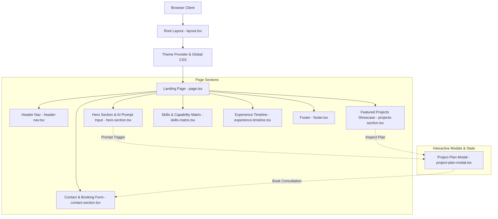

# System Architecture & Technical Overview

This document provides a comprehensive technical breakdown of the portfolio application's frontend architecture, design choices, component hierarchy, state flow, and performance standards.

---

## Technical Stack & Principles

- **Framework**: Next.js 16 (App Router with React 19)
- **Styling**: Tailwind CSS v4 + Vanilla CSS custom variables (`globals.css`)
- **UI & Icons**: Lucide React, Shadcn UI primitives, custom animated vectors
- **Theme Management**: `next-themes` (Dark mode default with glowing amber/zinc visual accents)
- **Type Safety**: TypeScript 5 in strict mode
- **Bundler & Tooling**: Turbopack & ESLint v10

---

## High-Level Architecture Diagram



---

## Component Hierarchy & Directory Breakdown

```
app/
 ├── layout.tsx            # Root HTML structure, font loading, dark theme provider
 ├── page.tsx              # Main single-page portfolio layout & top-level state orchestration
 └── globals.css           # Global Tailwind directives, color tokens, custom animations

components/
 ├── header-nav.tsx        # Top navigation with sticky blur header and CTA actions
 ├── hero-section.tsx      # Split hero: Pitch presentation + interactive AI Project Plan generator
 ├── projects-section.tsx  # Interactive grid showcasing key projects with status tags & tech badges
 ├── project-plan-modal.tsx# Interactive modal showing deep project architectures, tech stack & milestones
 ├── skills-matrix.tsx     # Categorized competency matrix (Frontend, Backend, AI/ML, DevOps)
 ├── experience-timeline.tsx# Career milestone timeline with impact metrics & role descriptions
 ├── contact-section.tsx   # Interactive consultation booking & direct contact form
 ├── footer.tsx            # Footer with quick links and copyright notices
 ├── theme-provider.tsx    # Next-themes wrapper for consistent client-side hydration
 ├── icons.tsx             # Custom SVG icon set and brand emblems
 └── ui/                   # Modular Shadcn-inspired primitives (Button, Modal, Card, Input)

lib/
 └── utils.ts              # Utility functions for class name merging (clsx + tailwind-merge)
```

---

## State Management & Interactivity Flow

1. **Global App State (`app/page.tsx`)**:
   - `selectedPlan`: Holds the active `ProjectPlanData` when a user selects a preset or generates a plan in the Hero prompt.
   - `isPlanModalOpen`: Boolean controlling visibility of the detailed `ProjectPlanModal`.
   - `consultationTopic`: Stores pre-populated context passed to the `ContactSection` when transitioning from a project plan directly to booking a consultation.

2. **Smooth Scroll Routing**:
   - Section navigation relies on HTML ID hooks (`#projects`, `#skills`, `#experience`, `#contact`).
   - Modal actions like `"Book Consultation for this Architecture"` invoke `scrollIntoView({ behavior: 'smooth' })` to focus the user seamlessly on the contact form with relevant context filled in.

---

## Design System & Theme Aesthetics

- **Color Palette**:
  - Background: Pitch dark (`#08080a`, `zinc-950`)
  - Accent / Primary Glow: Warm Amber (`amber-400`, `amber-500/10`)
  - Secondary Accents: Emerald (Production ready), Cyan (Beta), Indigo (Architecture)
  - Text Hierarchy: Primary `zinc-100`, Secondary `zinc-400`, Muted `zinc-500`
- **Typography**: Geist Sans & Geist Mono
- **Visual Effects**: Glassmorphism (`backdrop-blur-md`), subtle ambient radial background lighting, micro-interactions on hover.

---

## Performance & SEO Engineering

- **Static Pre-rendering**: Entire single page route is statically generated (`○ Static`) during `next build` for near-instant Time to First Byte (TTFB).
- **Zero Heavy Bundles**: No heavy 3D rendering libraries or unoptimized assets; rely on pure CSS hardware-accelerated transitions and vector icons.
- **Semantic HTML5**: Native `<header>`, `<main>`, `<section>`, `<article>`, and `<footer>` elements for screen-reader accessibility and optimal search indexing.
